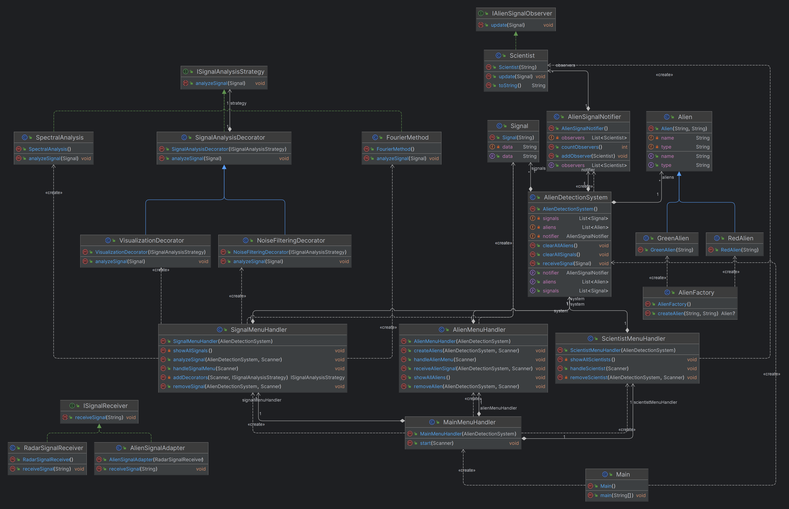

# Alien Detection System

## Getting Started

### Prerequisites

1. Ensure you have Java installed on your system.
2. Clone the repository to your local machine.

### Running the System

1. Open the project in your preferred Java IDE.
2. Execute the `Main` class located in the `ui` package to start the Alien Detection System.

### Interacting with the System

1. Follow the on-screen prompts to navigate through the Alien Detection System's menus.
2. Experiment with creating aliens, receiving signals, and analyzing data.

## Usage

The Alien Detection System offers a comprehensive set of features for managing and analyzing signals from extraterrestrial entities. Here's a brief overview of key functionalities:

### Signal Menu

1. **Receive Signal:**
   - Enter signal data to simulate receiving signals from alien sources.

2. **Analyze Signal:**
   - Analyze previously received signals using various signal analysis strategies.
   - Choose from Fourier Method, Spectral Analysis, and apply decorators for Noise Filtering and Visualization.

3. **Remove Signal:**
   - Remove unwanted signals from the system.

4. **Show all Signals:**
   - Display a list of all received signals.

5. **Clear all Signals:**
   - Remove all signals from the system.

### Alien Menu

1. **Create Aliens:**
   - Enter the name and type (Green or Red) to create new aliens.

2. **Remove Alien:**
   - Remove unwanted aliens from the system.

3. **Show all Aliens:**
   - Display a list of all created aliens.

4. **Clear all Aliens:**
   - Remove all aliens from the system.

5. **Receive Alien Signal:**
   - Simulate receiving signals from specific aliens.

### Scientist Menu

1. **Add Scientist:**
   - Enter the scientist's name to add them as an observer to the signal notifier.

2. **Remove Scientist:**
   - Remove unwanted scientists from the system.

3. **Show all Scientists:**
   - Display a list of all added scientists.

4. **Clear all Scientists:**
   - Remove all scientists from the system.

### General Navigation

- Navigate through the menus by entering the corresponding menu numbers.
- Follow on-screen prompts for each menu option.

Feel free to explore and experiment with different features to fully understand the capabilities of the Alien Detection System.

### Key Achievements

1. **Modularity and Flexibility:**
   - High modularity facilitates easy modification and extension of features.
   - Design patterns enhance flexibility, allowing the addition of new functionalities with minimal code changes.

2. **Scalability and Extensibility:**
   - Centralized alien creation using the Factory pattern facilitates the addition of new alien types.
   - Observer pattern ensures a scalable and decoupled notification system for scientists, accommodating future enhancements.

3. **Integration and Adaptability:**
   - Adapter pattern enables the integration of diverse signal sources, showcasing adaptability to different data formats.
   - Singleton pattern ensures a single, global point of access to the Alien Detection System, promoting centralized control.

### Challenges and Future Improvements

#### Challenges Faced:

1. **Dynamic Signal Analysis Strategies:**
   - Successfully addressed through the implementation of the Strategy Pattern.

2. **Decoupling and Extensibility:**
   - Balanced decoupling and extensibility through the application of the Decorator Pattern.

#### Future Improvements:

1. **Enhanced Visualization:**
   - Integration of advanced visualization techniques to provide scientists with more informative representations of signals.

2. **Machine Learning Integration:**
   - Exploration of machine learning algorithms for advanced signal pattern recognition.

3. **Real-Time Signal Analysis:**
   - Implementation of real-time signal analysis capabilities for immediate responses to alien activities.

### Pros and Cons

#### Pros:

1. **Modularity:**
   - High modularity facilitates easy modification and extension of features.

2. **Flexibility:**
   - Design patterns enhance flexibility, enabling the addition of new functionalities with minimal code changes.

3. **Scalability:**
   - The system is designed to accommodate future expansions, such as new signal analysis strategies or alien types.

#### Cons:

1. **Learning Curve:**
   - Extensive use of design patterns may pose a learning curve for developers unfamiliar with these concepts.

2. **Complexity:**
   - While modular, the system's structure may be perceived as complex for smaller-scale applications.

### Real-Life Applications

The Alien Detection System, with its adaptable design patterns, finds applications in real-life scenarios such as astrophysics research, military defense, and environmental monitoring. Its modular architecture positions it as a versatile tool for detecting and analyzing signals, making it applicable in various domains.

### References

1. **"Design Patterns: Elements of Reusable Object-Oriented Software" by Erich Gamma, Richard Helm, Ralph Johnson, John Vlissides**
   - A foundational resource for understanding design patterns and their application.

2. **Oracle Documentation**
   - Official Java documentation provided crucial insights into design pattern best practices and implementation details.

3. **Online Resources**
   - Various online tutorials, forums, and articles contributed to solving specific challenges and enhancing understanding.

## Conclusion

The Alien Detection System is a versatile and modular solution designed for managing and analyzing signals from extraterrestrial entities. Employing six key design patterns - Singleton, Strategy, Decorator, Factory, Adapter, and Observer - the project achieves a scalable and maintainable architecture. Each pattern addresses specific concerns, contributing to the system's adaptability and flexibility.

### UML Diagram

